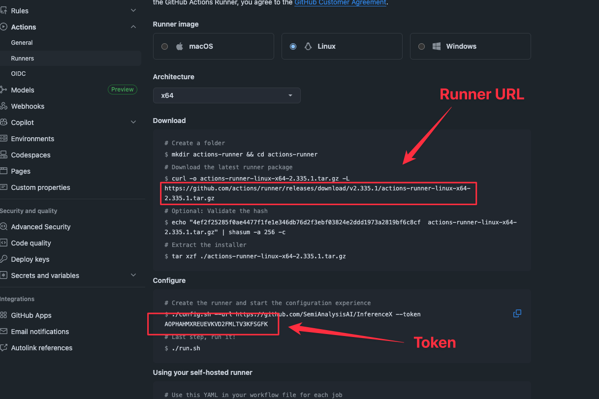

# Self-hosted runner setup

Scripts for bulk-provisioning the self-hosted GitHub Actions runners that execute
InferenceX benchmark jobs on the GPU clusters.

- [`setup.sh`](setup.sh) — downloads the actions-runner tarball once and configures N runner
  instances in parallel under a base directory.
- [`start_runners.sh`](start_runners.sh) — starts the configured runners inside a tmux session,
  one tiled pane per runner.

## Prerequisites

1. **Decide which user the GitHub Actions processes will run under.** This user's home
   directory must be on shared storage that is mounted on **all compute nodes** of the
   cluster — the runner work directories (`_work`) hold checkouts, logs, and artifacts
   that Slurm jobs on compute nodes read and write.
2. The host needs `curl`, `tar`, and `tmux`. Run the setup from a normal login shell so
   that the runner captures a sane `PATH` (including the Slurm binaries — `sinfo`,
   `srun`, `sbatch`); the runner snapshots `PATH` into `.path` at configuration time.

## Setup

1. Under the chosen user's home directory, create the runner base directory:

   ```bash
   mkdir -p ~/gharunners && cd ~/gharunners
   ```

2. Clone InferenceX (or just copy the two scripts in this directory onto the host):

   ```bash
   git clone https://github.com/SemiAnalysisAI/InferenceX.git
   ```

3. Navigate to
   [github.com/SemiAnalysisAI/InferenceX/settings/actions/runners/new?arch=x64&os=linux](https://github.com/SemiAnalysisAI/InferenceX/settings/actions/runners/new?arch=x64&os=linux)
   to fetch the **registration token** and **runner tarball URL**, which are inputs to
   `setup.sh`:

   

   > ⚠️ The registration token expires after ~1 hour. If `config.sh` starts failing with
   > authentication errors partway through, refresh the page and re-run with a new token.

4. Configure the runners:

   ```bash
   ./InferenceX/utils/runner_setup/setup.sh \
     <TOKEN> \
     <RUNNER_URL> \
     <START_INDEX> <END_INDEX> \
     ~/gharunners \
     <BASE_RUNNER_NAME> \
     <ADDITIONAL_RUNNER_TAGS>
   ```

   Example — 14 runners (`b300-nv_00` … `b300-nv_13`) on the B300 cluster:

   ```bash
   ./InferenceX/utils/runner_setup/setup.sh \
     AOPHAHI... \
     https://github.com/actions/runner/releases/download/v2.335.1/actions-runner-linux-x64-2.335.1.tar.gz \
     0 13 \
     ~/gharunners \
     b300-nv \
     slurm,b300
   ```

   This creates `gharunner00/actions-runner` … `gharunner13/actions-runner` under the
   base directory, all sharing one downloaded tarball.

5. Start the runners:

   ```bash
   ./InferenceX/utils/runner_setup/start_runners.sh 0 13 ~/gharunners
   ```

   This (re)creates a tmux session (default name: `github-actions`) with one tiled pane
   per runner running `./run.sh`. Reattach later with `tmux attach -t github-actions`.

6. Verify the runners show up as **Idle** on the
   [runners settings page](https://github.com/SemiAnalysisAI/InferenceX/settings/actions/runners),
   then register them in the repo config (see below).

## Naming convention — read this before picking `BASE_RUNNER_NAME`

Runner names are **load-bearing**. Each runner is named `<BASE_RUNNER_NAME>_<NN>`
(zero-padded two-digit index), e.g. `b300-nv_07`, and two pieces of CI infrastructure
key off that name:

1. **The launch script is selected from the name prefix.** The benchmark workflows run

   ```bash
   bash ./runners/launch_${RUNNER_NAME%%_*}.sh
   ```

   so everything before the first `_` must match an existing script in
   [`runners/`](../../runners) — e.g. runner `b300-nv_07` → `runners/launch_b300-nv.sh`.
   For a brand-new cluster, add a `runners/launch_<BASE_RUNNER_NAME>.sh` first.
   Corollary: `BASE_RUNNER_NAME` itself must not contain `_` (use hyphens).

2. **Sweep scheduling looks runners up by exact name.** Jobs are distributed across the
   runner names listed per SKU in
   [`.github/configs/runners.yaml`](../../.github/configs/runners.yaml). New runners do
   **not** receive sweep jobs until they are added there, and the entries must match the
   registered names exactly — including zero-padding. (Some older fleets predate the
   padded convention, e.g. `h200-dgxc-slurm_0`; `setup.sh` always zero-pads, so new
   entries should use the padded form.)

## Labels / `ADDITIONAL_RUNNER_TAGS`

`setup.sh` registers each runner with labels `<ADDITIONAL_RUNNER_TAGS>,<RUNNER_NAME>`
(on top of the implicit `self-hosted`, `Linux`, `X64`). Conventions in use:

- `slurm` — the runner submits work through Slurm.
- The SKU name (`b200`, `b300`, `h200`, `gb300`, …) — coarse hardware targeting.
- Optional sub-fleet tags, e.g. `b200-dgxc`, `b200-dsv4` — used to carve out dedicated
  capacity.

The per-runner name label (`b300-nv_07`) is what `runs-on` resolves for sweep jobs, so
always keep it (the script appends it automatically). A typical registered runner ends
up with labels like:

```
self-hosted, Linux, X64, slurm, b200, b200-dsv4, b200-dgxc, b200-dgxc_00
```

Labels can be edited later on the runners settings page without re-registering.

## Storage layout

The login node (where the runners live) and the Slurm compute nodes (where benchmarks
run) exchange everything through the filesystem, so every path the CI touches must be
visible from the compute node that the job lands on. That means each path must either
live on **shared storage**, or **exist identically on every compute node** (e.g. local
NVMe at the same mount point). Four classes of paths to set up per cluster — the host
side of each is defined in that cluster's `runners/launch_<cluster>.sh`:

1. **Runner home / `_work` directories** — must be shared storage (see Prerequisites).
   The job checkout, scripts, and result artifacts live here and are bind-mounted into
   the benchmark container (`$GITHUB_WORKSPACE`).
2. **HF hub cache** — the workflows set the *container-side* path globally
   (`HF_HUB_CACHE=/mnt/hf_hub_cache/` in `benchmark-tmpl.yml`); each launch script
   bind-mounts a per-cluster *host* path `HF_HUB_CACHE_MOUNT` over it. Examples in use:
   `/mnt/nfs/sa-shared/gharunners/hf-hub-cache/` (h100, shared NFS),
   `/mnt/vast/gharunner/hf-hub-cache` (CoreWeave, shared VAST),
   `/tmp/gharunner/hf-hub-cache` (b200-cw, node-local — same path on every node, but
   each node downloads its own copy, so prefer shared storage where available).
3. **Pre-staged model weights** — large models are not downloaded from HF in CI. The
   launch scripts override `MODEL_PATH` to per-cluster staging directories
   (e.g. `/lustre/fsw/models/...` on b200-dgxc, `/data/models/...` on b300,
   read-only `/scratch/models/` on b300 multinode). Bringing up a new model on a
   cluster means staging the weights there first.
4. **Squash images** — launch scripts `enroot import` each Docker image once into a
   `.sqsh` file under a shared `SQUASH_DIR` (e.g. `/home/sa-shared/containers` on
   b200-dgxc, `/mnt/lustre01/users-public/sa-shared`
   on gb200), then launch with `--container-image=<file>.sqsh`. This must be on shared
   storage because pyxis reads the file on the **compute** node, and it lets concurrent
   jobs reuse one import instead of each pulling the registry image. Note
   `ENROOT_CACHE_PATH` (import scratch space) defaults under `$HOME/.cache/enroot`.

Size accordingly: weights run hundreds of GB to TB per model, `.sqsh` files are
~20–40 GB each and accumulate one per image tag (clean old tags periodically), and the
HF cache grows with datasets/tokenizers.

When provisioning a **new cluster**, decide these locations up front and encode them in
the new `runners/launch_<cluster>.sh`.

## Gotchas

- **Runners do not survive reboots.** They run via `./run.sh` in tmux, not as a systemd
  service — after node maintenance, re-run `start_runners.sh` (it kills and recreates
  the session, which is safe for idle runners).
- **Large fleets vs. tmux panes:** `start_runners.sh` puts every runner in one tiled
  window; with ~15+ runners panes can get too small and `split-window` may fail with
  `no space for new pane`. Split into ranges across multiple sessions via the optional
  `SESSION_NAME` argument.
- **Removing runners:** from the runner directory, stop the process and run
  `./config.sh remove --token <removal-token>` (token from the runners settings page).
  Remember to also delete the name from `.github/configs/runners.yaml`.
